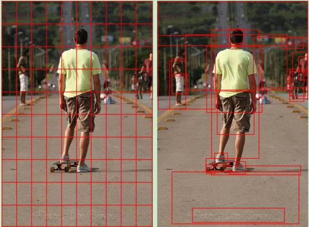
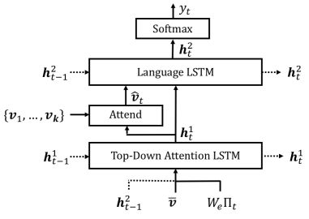

# Paddle-BUTD-Captioning

[简体中文](./README_ch.md) | English
   
## 1 Introduction
Paper：《Bottom-Up and Top-Down Attention for Image Captioning and Visual Question Answering》[paper](https://ieeexplore.ieee.org/document/8578734)

There are two kinds of Attention mechanisms in human visual system: top-down Attention and bottom-up Attention.  In the former, attention is determined by the task at hand, and we focus on the parts closely related to the task, while in the latter, attention means that we are attracted to the salient and outstanding things.  Most visual attention belongs to top-down type. Images are taken as input, weight distribution is paid attention to in modeling, and then image features extracted by CNN are acted on.  However, the attentional image of this method corresponds to the left image below, without considering the content of the image.  For humans, Attention is more focused on the target in the picture or other prominent areas, so the author of this paper introduced the mechanism of bottom-up Attention, as shown in the right picture below, which applies Attention to prominent objects.  



Caption Model As shown below, the model has two LSTM modules, one is Language LSTM, the other is top-down Attention LSTM.  In this paper, bottom-up Attention is extracted by the Faster R-CNN method in the field of object detection.  



[Refer to the project address link](https://github.com/ruotianluo/ImageCaptioning.pytorch)

## 2 Accuracy
The code is trained on COCO2014 data set, and the reproducibility accuracy is as follows:

Cross-entropy Training
|Bleu_1|Bleu_2|Bleu_3|Bleu_4|METEOR|ROUGE_L|CIDEr|SPICE|
| :---: | :---: | :---: | :---: | :---: | :---: | :---: | :---: | 
|0.761|0.598|0.459|0.350|0.272|0.562|1.107|0.203|

SCST(Self-critical Sequence Training)
|Bleu_1|Bleu_2|Bleu_3|Bleu_4|METEOR|ROUGE_L|CIDEr|SPICE|
| :---: | :---: | :---: | :---: | :---: | :---: | :---: | :---: | 
|0.799|0.641|0.493|0.373|0.275|0.580|1.202|0.209|

## 3 Dataset
coco2014 image captions [paper](https://link.springer.com/chapter/10.1007/978-3-319-10602-1_48)，“Karpathy” data split [论文](https://arxiv.org/pdf/1412.2306v2.pdf)

[coco2014 Dataset download](https://aistudio.baidu.com/aistudio/datasetdetail/28191)

- dataset size：123287
  - train：113287
  - val：5000
  - test：5000
- label：dataset_coco.json

## 4 Environment
paddlepaddle-gpu==2.1.2  cuda 10.2

opencv-python==4.5.3.56

yacs==0.1.7

yaml==0.2.5

## 5 Quick start

### step1: load data

Load preprocessed data files are all placed under the data/repo

[“Karpathy” data split json](https://aistudio.baidu.com/aistudio/datasetdetail/107078)

Bottom-up original feature file extracted by Faster R-CNN model [link] (https://github.com/ruotianluo/ImageCaptioning.pytorch/blob/master/data/README.md)

Generate cocotalk label.h5 and cocoktalk.json files
```bash
python scripts/prepro_labels.py
```

Generate cocobu_att, pool cocobu_FC, and border cocobu_box 
```bash
python scripts/make_bu_data.py
```

[load the above pretraining data](https://aistudio.baidu.com/aistudio/datasetdetail/107198). cocobu_att is uploaded into cocobu_att_train and cocobu_att_val. After the loading is complete, cocobu_att should be merged into cocobu_att.

**Install dependencies**
```bash
pip install -r requestments.txt
```

### step2: train

The training process is divided into two steps：Cross-entropy Training和SCST(Self-critical Sequence Training)

Cross-entropy Training：

```bash
python3 train.py --cfg configs/updown.yml  
```

SCST(Self-critical Sequence Training)：

```bash
python3 train.py --cfg configs/updown_rl.yml
```

The trained model data and logs are placed under the log/repo

### step3: eval

```bash
python eval.py
```

During the test, the program will load the training model data saved in the log/repo.  

[Download the trained model data](https://aistudio.baidu.com/aistudio/datasetdetail/108181), into the log/repo, then perform validation instructions directly.  

## 6 Code structure

### 6.1 structure

```
├─config                        
├─models                          
├─misc                            
├─modules                         
├─data                            
├─scripts                         
│  eval.py                       
│  dataloader.py                  
│  README.md                      
│  requirements.txt               
│  train.py                       
```
### 6.2 Parameter description

Training and evaluation parameters can be set in the config file.

## 7 Model information

For other information about the model, please refer to the following table:

| information | description |
| --- | --- |
| Author | Lieber |
| Date | 2021.09 |
| Framework version | Paddle 2.1.2 |
| Application scenarios | multi-modal |
| Support hardware | GPU、CPU |
| Download link | [best model](https://aistudio.baidu.com/aistudio/datasetdetail/108181)|
|Online operation| [notebook](https://aistudio.baidu.com/aistudio/projectdetail/2345929)|
| summarize | [forum](https://aistudio.baidu.com/paddle/forum/topic/show/991202)|
